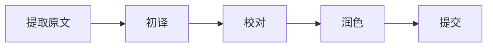

# 翻译工作流程 (Translation Workflow)

## 📊 项目进度

- ✅ PDF 文本提取完成（370页，122K单词）
- ✅ 章节分割完成（13章 + 附录）
- ⏳ 翻译进行中

## 🎯 翻译策略

### 1. 章节优先级

| 章节 | 标题 | 优先级 | 状态 |
|------|------|--------|------|
| 前言 | Preface | 🔴 高 | 翻译中 |
| 第1章 | The analytical investor | 🔴 高 | 待翻译 |
| 第2章 | Investment essentials | 🔴 高 | 待翻译 |
| 第3章 | Collecting data | 🟡 中 | 待翻译 |
| 第4章 | Growth portfolios | 🟡 中 | 待翻译 |
| 第5章 | Income portfolios | 🟡 中 | 待翻译 |
| 第6章 | Building an asset monitor | 🟢 低 | 待翻译 |
| 第7章 | Risk management | 🟢 低 | 待翻译 |
| 第8章 | AI for financial research | 🔴 高 | 待翻译 |
| 第9章 | AI agents | 🔴 高 | 待翻译 |
| 第10章 | Charts and technical analysis | 🟡 中 | 待翻译 |
| 第11章 | Algorithmic trading | 🟡 中 | 待翻译 |
| 第12章 | Private equity | 🟢 低 | 待翻译 |
| 第13章 | The road goes ever on | 🟢 低 | 待翻译 |

### 2. 翻译质量标准

#### 准确性
- ✅ 保留原文核心意思
- ✅ 金融术语准确翻译
- ✅ 技术概念清晰传达

#### 可读性
- ✅ 中文表达流畅自然
- ✅ 符合中文阅读习惯
- ✅ 避免直译生硬

#### 专业性
- ✅ 统一术语翻译
- ✅ 保留专业缩写（ETF, S&P 500等）
- ✅ 代码和技术内容保持原样

### 3. 翻译流程



#### 步骤说明

1. **初译**（AI辅助）
   - 使用 Claude/ChatGPT 初步翻译
   - 保留原文结构和格式
   - 标注不确定的术语

2. **校对**（人工审核）
   - 检查术语一致性
   - 修正翻译错误
   - 确保意思准确

3. **润色**（语言优化）
   - 提升文字流畅度
   - 统一表达风格
   - 优化排版格式

4. **提交**（版本控制）
   - 提交到 GitHub
   - 创建 Pull Request
   - 同行评审

### 4. 术语对照表

| 英文 | 中文 | 备注 |
|------|------|------|
| Assets | 资产 |  |
| Portfolio | 投资组合 |  |
| Equity | 股票/权益 | 根据上下文 |
| Bonds | 债券 |  |
| ETF (Exchange-Traded Fund) | 交易所交易基金 | 保留ETF |
| Crypto | 加密货币 |  |
| Derivatives | 衍生品 |  |
| Dividends | 股息 |  |
| Capitalization | 市值 |  |
| Volatility | 波动性 |  |
| Liquidity | 流动性 |  |
| ROI (Return on Investment) | 投资回报率 | 保留ROI |
| P/E Ratio (Price-to-Earnings) | 市盈率 |  |
| Bull market | 牛市 |  |
| Bear market | 熊市 |  |
| Long position | 多头/做多 |  |
| Short position | 空头/做空 |  |
| Stop-loss | 止损 |  |
| Hedge | 对冲 |  |
| Diversification | 多元化/分散投资 |  |
| Value at Risk (VaR) | 风险价值 | 保留VaR |
| Large Language Models (LLMs) | 大语言模型 | 保留LLMs |
| RAG (Retrieval-Augmented Generation) | 检索增强生成 | 保留RAG |

### 5. 文件命名规范

```
chapters/
├── 00-preface.md              # 前言
├── 01-the-analytical-investor.md
├── 02-investment-essentials.md
├── ...
└── 13-appendix.md            # 附录

translation-notes/
├── terminology.md            # 术语表
├── style-guide.md            # 翻译规范
└── progress.md               # 进度追踪
```

### 6. Markdown 格式规范

```markdown
# 第X章：章节标题

## X.1 小节标题

正文内容...

### 要点列表
- 要点1
- 要点2

### 代码块
```python
# 代码保持原样
def example():
    pass
```

### 表格
| 列1 | 列2 |
|-----|-----|
| 数据1 | 数据2 |

### 引用
> 重要引用内容

**重点内容** 使用加粗
*斜体内容* 使用斜体
```

### 7. 质量检查清单

在提交翻译前，请确认：

- [ ] 所有术语符合术语对照表
- [ ] 没有明显的翻译错误
- [ ] 代码块保持原样
- [ ] 格式统一规范
- [ ] 标点符号使用正确（中文使用全角标点）
- [ ] 数字和单位格式统一
- [ ] 人名和地名翻译一致

### 8. 翻译示例

#### 原文（英文）
> Value at Risk (VaR) is a statistical measure that quantifies the level of financial risk within a firm or investment portfolio over a specific time frame.

#### 译文（中文）
> 风险价值（Value at Risk，VaR）是一种统计指标，用于量化特定时间范围内公司或投资组合的金融风险水平。

#### 翻译要点
- ✅ 保留专业术语缩写 VaR
- ✅ 第一次出现时注明全称
- ✅ 语言流畅自然
- ✅ 准确传达原文意思

### 9. 协作流程

#### Fork & Pull Request 工作流

1. **Fork 仓库**
   ```bash
   # GitHub 网页操作：点击 Fork 按钮
   ```

2. **克隆到本地**
   ```bash
   git clone https://github.com/YOUR_USERNAME/investing-for-programmers-zh.git
   cd investing-for-programmers-zh
   ```

3. **创建翻译分支**
   ```bash
   git checkout -b translate/chapter-01
   ```

4. **进行翻译**
   - 复制原文文件
   - 翻译内容
   - 检查质量

5. **提交更改**
   ```bash
   git add chapters/01-the-analytical-investor.md
   git commit -m "Translate: Chapter 1 - The analytical investor"
   ```

6. **推送到 GitHub**
   ```bash
   git push origin translate/chapter-01
   ```

7. **创建 Pull Request**
   - GitHub 网页操作：点击 "Compare & pull request"
   - 填写 PR 描述
   - 等待审核

### 10. 工具推荐

#### AI 翻译工具
- **Claude** - 推荐，翻译质量高
- **ChatGPT** - 推荐，支持长文本
- **DeepL** - 备选，适合段落翻译

#### 本地工具
- **VS Code** - 编辑和预览
- **Typora** - Markdown 编辑
- **Grammarly** - 英文校对

#### 在线工具
- **GitHub** - 版本控制和协作
- **Markdown Preview** - 实时预览

---

## 📝 当前进度

### 已完成
- ✅ PDF 文本提取（370页，122K字）
- ✅ 章节分割（13章 + 附录）
- ✅ 术语表建立

### 进行中
- ⏳ 前言翻译

### 待开始
- ⏳ 第1章翻译
- ⏳ 第2章翻译

---

## 🎯 下一步行动

1. **完成前言翻译**
2. **创建翻译模板**
3. **建立同行评审机制**
4. **招募更多贡献者**

---

*最后更新：2026-03-08*
